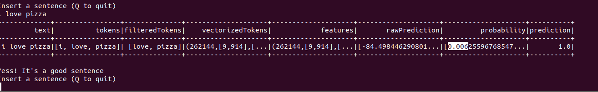

# Big Data Project

A spark-based application for tweet's *sentiment analysis*, running inside an Hadoop cluster

---
#### Table Of Contents
1. [Project Goals](https://github.com/baldidon/Big-Data-Project#project-goals-)
2. [Cluster Setup](https://github.com/baldidon/Big-Data-Project#cluster-setup)   
3. [Usage](https://github.com/baldidon/Big-Data-Project#usage)
---

## Project goals <a name="Project goals"/>
With this project, we wanted to explore usage some of the most popular softwares for *Big Data management*. 
In detail, we've used **Apache Hadoop** for build-up a 3-node cluster (**with HDFS as FS**) and we use **Apache Spark** above them whith **MLlib**, a Spark library for design machine learning's models.
For task (*given a tweet/phrase, choose if it's a positive or negative comment*), we've choose to use **Naive Bayes classifier**: the perfect trade off between simplicity and performance. Thanks by a
simple (and quite incorrect for documents) hypotesis: the features (in this case words) of a sample (in this case a text/tweet) are *independent random variables*.  Altough in a text words might be correlated, this
model provide good performance!

As Dataset, the [Μαριος Μιχαηλιδης KazAnova dataset](https://www.kaggle.com/kazanova/sentiment140) was perfect: tons of labeled tweet (**1.6 millions of tweets!!**) for justify the distributed approach and high usability.
Below a snippet of the dataset
| Target | ids | date | flag | user | text|
| --- | --- | --- | --- | --- | --- |
|0|"1467810369"|"Mon Apr 06 22:19:45 PDT 2009"|"NO_QUERY"|"_TheSpecialOne_"|"@switchfoot http://twitpic.com/2y1zl - Awww, that's a bummer.  You shoulda got David Carr of Third Day to do it. 	D"|									
|0|"1467810672"|"Mon Apr 06 22:19:49 PDT 2009"|"NO_QUERY"|"scotthamilton"|"is upset that he can't update his Facebook by texting it... and might cry as a result  School today also. Blah!"				|						
<!--
|0|"1467810917"|"Mon Apr 06 22:19:53 PDT 2009"|"NO_QUERY"|"mattycus"|"@Kenichan I dived many times for the ball. Managed to save 50%  The rest go out of bounds"										|
|0|"1467811184"|"Mon Apr 06 22:19:57 PDT 2009"|"NO_QUERY"|"ElleCTF"|"my whole body feels itchy and like its on fire "										|
-->

* target: the sentiment of the tweet (0 = negative, 1 = positive)
* ids: The id of the tweet ( 2087)
* date: the date of the tweet (Sat May 16 23:58:44 UTC 2009)
* flag: Used for lyx queries. Useless
* user: the user that tweeted
* text: the text of the tweet

For the application, only *Target* and *Text* colums are needed.

The cluster is developed with 3 virtual machines which are running Ubuntu 20.04.3: 1 **MasterNode** (it running Namenode, SecondaryNamenode and ResourceManager  processes and submit the spark application) and 2 **WorkerNode** (runnning tasks, Datanode and NodeManager processes). All 3 machines running on the same local network (sams subclass o private addresses), so the can communicate through local network and not over internet!


# Cluster setup

## Requirements
- [Apache Spark 3.0.3](https://spark.apache.org/releases/spark-release-3-0-3.html)
- [Apache Hadoop 3.2.2](https://hadoop.apache.org/docs/r3.2.2/)
- [Apache MLlib](https://spark.apache.org/mllib/)
- Java 8 (We know, it's weird use Java for an ML task :-) )

## Setup Hadoop cluster
first of all, it's recommended create a new user on the O.S. for build up the cluster.
The first step is settingUp Secure SHell (ssh) on all machines to permit to Master and WorkerNode the passwordlesses access.

Execute this commands separately:
```bash
sudo apt install ssh
sudo apt install pdsh
nano .bashrc
export PDSH_RCMD_TYPE=ssh
ssh-keygen -t rsa -P ""
cat ~/.ssh/id_rsa.pub >> ~/.ssh/authorized_keys
```
In the end, if everything gone well, ``` ssh localhost``` working without password request.

Next, java and hadoop must be installed. After, add to file ```(path to your hadoop installation, is recomended to move folders in /usr/local directory)/etc/hadoop/hadoop-env.sh``` the following variable:

```bash 
export JAVA_HOME=/usr/lib/jvm/java-8-openjdk-amd64/
```

then add the following config to ```/etc/enviroment```:
```bash
PATH="/usr/local/sbin:/usr/local/bin:/usr/sbin:/usr/bin:/sbin:/bin:/usr/games:/usr/local/games:/usr/local/hadoop/bin:/usr/local/hadoop/sbin"JAVA_HOME="/usr/lib/jvm/java-8-openjdk-amd64/jre"
```

---
### Network setup
Open file ```/etc/hosts``` with sudo and insert on each machine the ip address and the Hostname of the other machine, like this:

```bash
sudo nano /etc/hosts
```

```bash
# ip address of machines and their hostnames
xxx.xxx.xxx.xxx MasterNode
xxx.xxx.xxx.xxx WorkerNode
xxx.xxx.xxx.xxx WorkerNode
```

in this snippet, we assumed that the machines's hostnames are MasterNode, WorkerNode and WorkerNode2. For change the hostname go to file ```etc/hostname``` and change the name.

After that, we need to distribute between all nodes of cluster a *public-key* for ssh access. On the machine "master" execute first the command for *generate* the key, then the commands for do a *secure-copy* inside all machines:

```bash
ssh-keygen -t rsa
ssh-copy-id hadoopuser@hadoop-master
ssh-copy-id hadoopuser@hadoop-slave1
ssh-copy-id hadoopuser@hadoop-slave2
```
**PAY ATTENTION: change hadoopuser with right user of machine and hadoop-# with correct hostnames!!**

---
### Configure HDFS

On the master node, open file ```path-to-hadoop/etc/hadoop/core-site.xml``` and add the following configuration:

```xml
<configuration>
   <property>
    <name>fs.defaultFS</name>
    <value>hdfs://MasterNode:9000</value>
      <!-- change MasterNode with correct hostname -->
  </property>
</configuration>
```
Still on master node, open  ```path-to-hadoop/etc/hadoop/hdfs-site.xml``` and add:

```xml
<configuration>
   <property>
      <name>dfs.namenode.name.dir</name><value>path-to-hadoop/data/nameNode</value>
   </property>
   <property>
      <name>dfs.datanode.data.dir</name><value>path-to-hadoop/data/dataNode</value>
   </property>
   <property>
      <name>dfs.replication</name>
      <value>2</value>
   </property>
</configuration>
```

then open ```path-to-hadoop/etc/hadoop/workers``` and add Hostnames of workers:

```text
WorkerNode1
WorkerNode2
```
Same thing for define hostname of masternode, inside  ```path-to-hadoop/etc/hadoop/master```:

```text
MasterNode
``` 


We need to copy theese configs on workers, execute:

```
scp path-to-hadoop/etc/hadoop/* (worker hostname):path-to-hadoop/etc/hadoop/
scp path-to-hadoop/etc/hadoop/* (worker hostname):path-to-hadoop/etc/hadoop/
```

After all, next step is format the HDFS fs! Run:

```
source /etc/environment
hdfs namenode -format
```
and then

```
start-dfs.sh
```

after this procedure, on the workers execute ```jps``` and if is present **Datanode** process, everything gone well!.
Open ```https://ip-master:9870``` to open HDFS web panel.

---
### YARN setup
On master, execute:

```
export HADOOP_HOME="path-to-hadoop"
export HADOOP_COMMON_HOME=$HADOOP_HOME
export HADOOP_CONF_DIR=$HADOOP_HOME/etc/hadoop
export HADOOP_HDFS_HOME=$HADOOP_HOME
export HADOOP_MAPRED_HOME=$HADOOP_HOME
export HADOOP_YARN_HOME=$HADOOP_HOME
```

Next, open on both worker nodes (not on master) ``` $HADOOP_HOME/yarn_site.xml ``` and paste between <configuration> tags:
```xml
   <property>
      <name>yarn.resourcemanager.hostname</name>
      <value>MasterNode</value>
   </property>
```
Finally, the next step is launch yarn on master, with:
```
   start-yarn.sh
```
and after open ```https://master-ip:8088/cluster``` to se hadoop web panel!

### Configure Apache Spark

In this case, considering that spark will be only the "execution engine above hadoop", the setup is much simpler than hadoop setup. 
First, download Spark, then add to ```bashrc``` the following variable (open with following command form home directory ```nano ./bashrc```):

```bash
export PATH=$PATH:/absolute-path-from-root-to-spark-folder/spark/bin
```

and then execute, to refresh configuration:
```bash
source ~/.bashrc
```

Last step is to configure a variable inside ```spark-env.sh``` file, it defines the environment for Spark. So, change directory to *conf* folder, inside your spark installation and then:

```bash
cd /folder-to-Spark/conf/
cp ./spark-env.sh.template  ./spark.env.sh

nano ./spark-env.sh
```

inside *spark-env* just simply add an export, referred to ```$HADOOP_HOME```:

```bash
export HADOOP_CONF_DIR=$HADOOP_HOME/etc/hadoop
```

Done! Setup finished!


---

## Usage

First of all, open the bin folder of this repo: there are two scripts and a jar file. The ```run-train.sh``` is a script for submitting the Training Application of classificator model and all transformation models (*necessary to make the data usable by the classifier*) to Hadoop. After training, application puts models into HDFS, so that the Training is executed once in a "lifetime".

**Note that: other info about the workflow are described inside the [*Project's paper*](docs/Tesina%20progetto%20big%20data%20management.pdf) inside docs folder**

After that, the ```run-test.sh``` script submit the test application; a command-line interaction where user can write sentences and retrive a prediction of sentiment (also with a verbose explanation about transformation applied to user input)!





   
